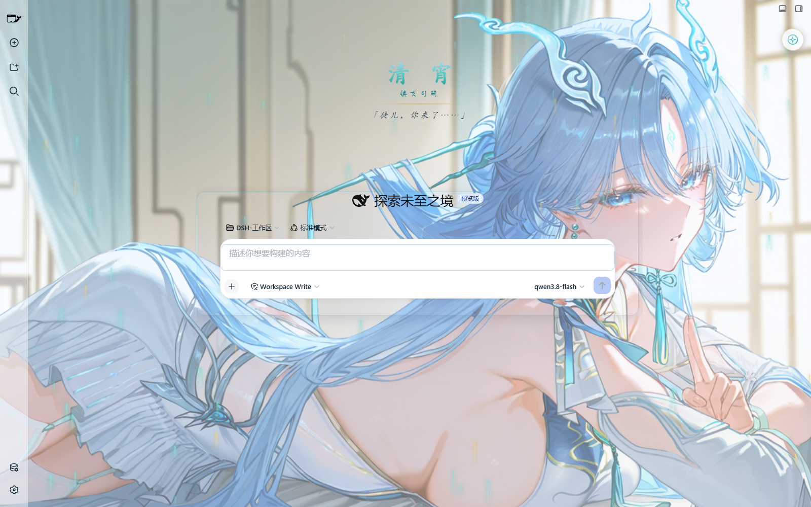
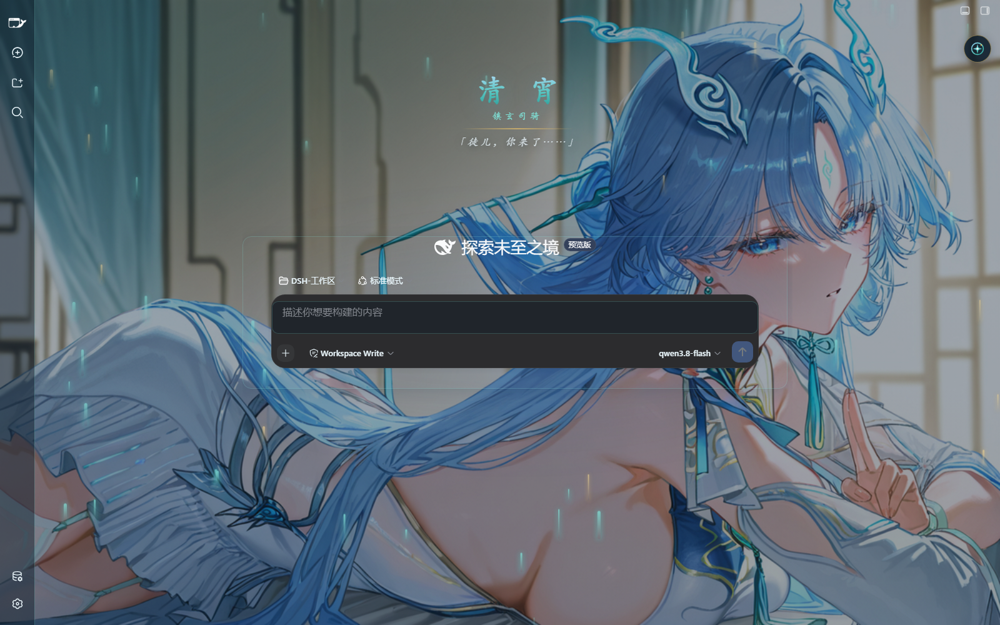

# 清宵 · 弦凝清霄 — DSH 美化包

以《鸣潮》角色**清宵**（3.6 版本「蜃云灯影，凡尘剑心」登场的五星气动·迅刀共鸣者，瑝珑「镇玄司骑」，琴剑双修的隐世剑仙）为主题的 DeepSeek Harness (DSH) Web 界面皮肤。

> 「弦凝千古寂，剑起满天清」

调色板取自清宵的形象设定：**冰蓝**（发色）、**青碧**（发饰与流苏）、**月白**（衣装）、**玄夜蓝**（暗色形态）、**鎏金**（金饰点缀）。





## 功能

- **默认背景画卷**：工作区提供的清宵插画（`assets/qx.jpg`）作为 DSH 使用界面的默认背景，亮暗两种形态共用。
- **自由更换背景**：设置面板内可分别为亮色 / 暗色形态上传自定义背景（PNG / JPG / WebP / GIF，≤7MB），一键复原默认画卷。
- **全局清宵主题**：侧边栏、按键、输入框、对话区、会话详情栏、滚动条、代码块、链接、选区等全部按冰蓝·青碧·月白·鎏金配色重制；暗色形态映射玄夜剑鸣氛围。
- **文字清晰度保障**：背景之上叠加可调浓度的渐变遮罩（scrim），内容面板使用半透明磨砂玻璃层；默认开启「文字对比增强」，亮色用墨青色文字、暗色用月白色文字，任何背景下都不糊字。
- **剑气流光**：可选的青碧/鎏金流光粒子装饰（遵循系统"减少动态效果"偏好）。
- **亮暗形态联动**：跟随 DSH 亮 / 暗主题切换，带一抹剑光扫幕过渡动画，浏览器 chrome 颜色与图标（玉青剑钰）同步更换。
- **新会话迎宾页**：空会话中央浮现「清 宵 · 镇玄司骑 · 徒儿，你来了……」迎宾题字，有消息后自动隐去。
- **设置持久化**：所有偏好通过 `/api/dsh-qingxiao/settings` 保存到 DSH profile 数据目录，换浏览器、重启后依然生效；接口不可用时自动回退到 localStorage。

## 版本

各版本改动见 [CHANGELOG.md](CHANGELOG.md)。

## 设置面板

点击界面右上角的**清宵剑钰圆形按钮**展开设置面板（调色盘）。按钮支持自由拖动，位置跨重启持久保存，面板底部提供「回到右上角」一键复位：

| 分区 | 控件 |
| --- | --- |
| 背景画卷 | 亮色 / 暗色形态背景更换与复原默认 |
| 阅读清晰度 | 文字对比增强开关 · 背景遮罩浓度 20–95% · 面板不透明度 30–100% · 正文字号缩放 85–125% |
| 界面琉璃 | 对话区宽度 500–1000px · 面板磨砂玻璃开关 |
| 剑气流光 | 启用开关 · 数量 0–60 · 速度 20–200% |
| 复原 | 全部恢复默认 |

## 版权所有人

| 版权所有人 | 版权所有内容 |
|---|---|
| Kuro Games（库洛游戏） | 「鸣潮」游戏作品及清宵（Qingxiao）角色形象原作 |
| Fumi（pixiv） | 默认背景插画（`assets/qx.jpg`）原作 |
| taoser | 皮肤覆盖层实现（CSS 配色、剑气流光、迎宾页与 DOM 装饰逻辑） |

\*本皮肤为同人创作，与 Kuro Games 无关联。

## 安装

### 懒人版

对你的 dsh 说：
```
安装一下这个皮肤包：https://github.com/taoser258/dsh-client-ui-skin-qingxiao
```

### 手动安装

**命令行安装**（任选其一）：

```sh
# 方式 A（推荐）：直接用 git URL 安装
dsh plugin --profile web add https://github.com/taoser258/dsh-client-ui-skin-qingxiao
```

```sh
# 方式 B：先克隆到本地任意位置，再把实际路径交给 dsh
git clone https://github.com/taoser258/dsh-client-ui-skin-qingxiao.git
dsh plugin --profile web add /path/to/dsh-client-ui-skin-qingxiao
```

**手动放置安装**：将本包完整复制到 DSH 的 `profiles/web/node_modules/@dsh-external/dsh-client-ui-skin-qingxiao/` 目录下，然后在 profile 的 `cordis.patch.yml` 中追加一条 insert 项（与本包自带的 `cordis.patch.yml` 保持一致）：

```yaml
- insert:
    - id: ui-skin-qingxiao
      name: '@dsh-external/dsh-client-ui-skin-qingxiao'
```

重启 DSH。

## 本地预览 / 开发

无需 DSH 即可预览完整效果（`preview/mockup.html` 会以真实 DOM 结构加载 `lib/client.js`）：

```sh
node preview/dev-server.mjs 8931
# 浏览器打开 http://127.0.0.1:8931/        （亮色）
#              http://127.0.0.1:8931/?theme=dark   （暗色）
#              http://127.0.0.1:8931/?panel=1      （自动展开设置面板）
```

## 兼容性

- DSH Web：0.1.0-rc.6 至 0.1.1-rc.2（dsh-web-frontend）
- 平台：Web
- 最近验证日期：2026-08-29

## 署名与许可

- 默认背景插画来自 **pixiv 画师 Fumi** 的《鸣潮》清宵同人插画（`assets/qx.jpg`），角色设定与游戏内容版权归库洛游戏所有。本皮肤仅供个人美化学习使用，与官方无关，请勿商用。
- 插件代码与结构在 CC BY-NC-SA 4.0 下发布，请勿用于商业用途。
